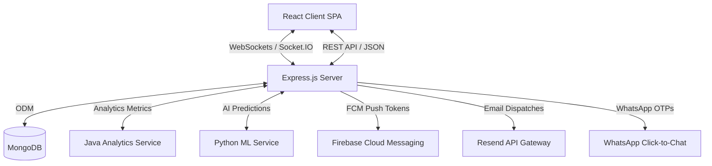

# 🩸 ONEDROP - Connecting Lives through Smart Blood Donation

**ONEDROP** is a premium, state-of-the-art Web & AI-powered integrated platform designed to bridge blood donors, recipients, hospitals, and administrative bodies. Featuring real-time regional matching, push notification alerts, automated WhatsApp OTP recovery, predictive AI analytics, and a interactive dashboard interface.

---

## 🌟 Key Features

- **🎯 Smart Blood Matching**: Real-time notifications dispatched to compatible donors using WebSockets (Socket.IO) and Firebase Cloud Messaging (FCM) based on proximity, blood group compatibility, and regional availability.
- **🛡️ Enforced Security Framework**: Email verification checkpoints at sign-in, account role verification (Donor, Recipient, Hospital, Admin, Super Admin), and automated JWT session expiration defenses.
- **💬 Secure Real-Time Chat**: Direct instant messaging channel between donors and recipients with custom status indicators, read receipts, and interactive emoji reactions.
- **📈 Advanced Analytics (Java/Spring Boot)**: Predictive regional metrics, hospital blood inventory levels, and live donation statistics.
- **🤖 Dedicated AI Bot Assistant**: A floating interactive chatbot integrated into the donor dashboard to guide users on eligibility criteria, donor guides, and emergency procedures.
- **🔑 WhatsApp OTP Account Recovery**: Direct 3-step WhatsApp Click-to-Chat integration for seamless credentials recovery and instant OTP dispatch.
- **🏆 Gamification Leaderboard**: Community XP, badges (e.g., *Hero Donor*, *Gold Donor*, *First Invite*), and reward points integration to incentivize voluntary blood donations.

---

## 🛠️ Technology Stack

| Component | Technology | Description |
| :--- | :--- | :--- |
| **Frontend** | React 18, Vite, Redux Toolkit, TailwindCSS, Lucide Icons | Premium UI with dark mode, animations (Framer Motion), responsive layout |
| **Backend API** | Node.js, Express, Mongoose, JWT Auth, CORS, Helmet | Secure REST API server with rate-limiting & telemetry integration |
| **Database** | MongoDB | Persistent document store for users, chat logs, requests, and logs |
| **Push Gateway** | Firebase SDK & Supabase Webhook | Multi-channel email alerts, cloud messaging tokens, and DB sync |
| **Analytics Engine** | Java, Spring Boot, Maven | High-performance aggregation and metrics processing |
| **Machine Learning** | Python, FastAPI | Demand forecasting, donor scoring, and smart matching predictions |

---

## 🏗️ Architecture Layout



---

## 🚀 Getting Started

### Prerequisites

Ensure you have the following installed on your machine:
- [Node.js](https://nodejs.org/) (v16+)
- [MongoDB](https://www.mongodb.com/) (running locally on port 27017 or Docker)
- [Docker & Docker Compose](https://www.docker.com/) (optional, for containerized run)
- [Java JDK 17 & Maven](https://maven.apache.org/) (for Analytics service)
- [Python 3.9+](https://www.python.org/) (for ML service)

### Running via Interactive PowerShell Launcher (Windows)

We have built a custom system control dashboard to verify dependencies and start service containers in single window commands.

1. Double-click the **`run_onedrop.bat`** file in the root directory, or open a PowerShell window and execute:
   ```powershell
   ./run_onedrop.ps1
   ```
2. Follow the terminal prompt to choose your mode:
   - **[1] Launch Core App**: Spawns Node Server and React Client.
   - **[2] Launch Full Platform**: Spawns Node Server, Client, ML Service, and Analytics Service in parallel.
   - **[3] Launch using Docker Compose**: Launches containerized multi-container setup.

---

## 📁 Repository Structure

```text
onedrop/
├── client/              # React (Vite) frontend application
├── server/              # Express.js REST API server & Socket.IO config
├── ml-service/          # Python AI/ML predictive analytics
├── analytics-service/   # Java Spring Boot aggregations
├── functions/           # Firebase cloud functions Firestore triggers
└── tools/               # Local tool storage directory
```

---

## 🤝 Contributing

Contributions to **ONEDROP** are always welcome! Feel free to open issues or submit pull requests.
